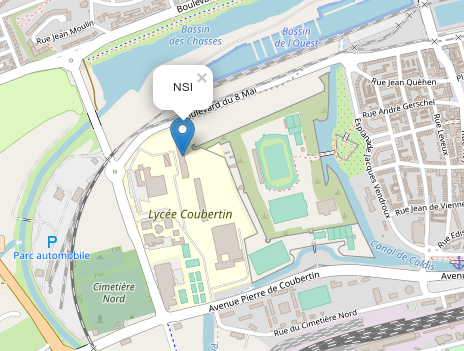

# Les données structurées
___
## Consignes de travail

Pour chaque exercice, un module python a été préparé pour être utilisé en réponse.
Vous trouverez dans le répertoire `support`, une liste de fichiers fournis pour ce TD.  
Un répertoire `annexes` est aussi présent : il comportera les fichiers de données que vous aurez créés.

___
## Exercices

!!! question "Exercice 1 : Création d'une table de données"

1. Établir un programme qui permet de :  
    - ouvrir le fichier 'personnes.csv' en mode lecture
    - lire les lignes contenues dans ce fichier
    - créer les variables de type list() suivantes :
        - `descripteurs`	contenant la valeur
        `['nom', 'prenom', 'age']`  
        - `donnees` 	contenant la valeur
            ```python
          	[['Durand', 'Jean-Pierre', '32'],
	        ['Dupont', 'Christophe', '51'],
	        ['Terta', 'Henry', '37'],
	        ['Kapri', 'Leon', '45'],
            ['Lenard', 'Georges', '15'],
            ['Herpan', 'stephan', '22'],
            ['Dupont', 'Christophe', '51']
            ['Mastic', 'Brice', '61'],
            ['Pouyeau', 'Maxime', '27'],
            ['Arox', 'Gilles', '51'],
            ['Follin', 'Paul', '32']]
            ```
    Aide : Vous utiliserez les méthodes pour les chaînes de caractères  
    `rstrip()` : pour éliminer les espaces et les caractères d’échappements (retour à la ligne...)  
    `split(separateur)` : pour découper chaîne de caractère en liste, en séparant les éléments
2. Établir la fonction `correction_majuscule` qui vérifie (et corrige) la majuscule de chaque nom et prénom dans la variable 'donnees'

3. Établir la fonction `doublons` qui élimine de la variable 'donnees' les enregistrements en double.

4. Établir la fonction `tri_age` qui ordonne les enregistrements de la variable 'donnees' par age décroissant.
??? tip "Aide :"
    Utiliser la méthode `sort` appliquée à une table (tableau de tableaux)  
    ```python
    table.sort(key = lambda tri : tri[indice], reverse = True or False)
    ```
    Remplacer par la table concernée	indice de la liste	décroissant ou croissant
5. Écrire un nouveau fichier `personnes_tri.csv` dans le répertoire `annexes` avec les nouvelles données.
Ce fichier doit garder la même structure que celui de départ.


!!! question "Exercice 2 :  Recherche dans une table"
    Dans le fichier `villes.csv`, on peut trouver des informations concernant des villes en France :

    - `departement` : numéro de département
    - `nom` : nom de la ville
    - `nb_habitants` : nombre d'habitants
    - `densite` : nombre d'habitants par km²
    - `surface` : aire de la ville en km²
    - `longitude` : longitude de la ville sur Terre
    - `latitude` : latitude de la ville sur Terre
    - `altitude_min` : altitude minimale de la ville par rapport au niveau de la mer
    - `altitude_max` : altitude maximale de la ville par rapport au niveau de la mer


1. Établir un programme qui permet d'établir la liste des `descripteurs` et celles des `donnees`.
2. Constituer une nouvelle table `grosses_villes` en sélectionnant les villes dont le nombre d'habitants est supérieur à 70 000.
3. Écrire un nouveau fichier `'grosses_villes.csv` dans le répertoire `annexes` regroupant les données de cette table.  
Ce fichier doit garder la même structure que celui de départ.
4. Toujours en utilisant cette table, établir une carte géographique avec la position de ces villes, en utilisant la bibliothèque `folium`.  
Ces dernières seront représentées par des disques de taille proportionnelle à leur nombre d'habitants.

!!! info "Installation de la bibliothèque `folium`" 
    Menu **Outils** puis **Gestionnaire de paquets**, rechercher **folium**, puis **Install**

    

!!! question "Exercice 3 : Travail supplémentaire"

1. Choisir 5 noms de villes étrangères où vous aimeriez aller.
2. Récupérer leurs coordonnées géographiques (longitude, latitude)
3. Établir un fichier au format CSV regroupant ces données et en y incluant celles de votre ville.
4. Placer ces villes sur une carte avec en les repérant par des marqueurs.  
Vous trouverez une liste de marqueurs sur ce site : [glyphicons](https://getbootstrap.com/docs/3.3/components/#glyphicons){:target = _blank}
5. Tracer un parcours de voyage sur la carte (en partant de votre ville).  
Joindre la carte dans les annexes.