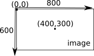

# Traitements d'image
___
## Module PIL

Le module "PIL" sera utilisé pour ce TP. Il sera à importer dans chaque exercice, afin de profiter de ces fonctions dédiées aux manipulations de fichier d'image.

Avant de commencer à écrire un programme qui permettra de travailler sur les pixels d'une image, il est nécessaire de préciser que chaque pixel a des coordonnées x,y.
{align=right}

Le pixel de coordonnées (0,0) se trouve en haut à gauche de l'image.

Si l'image fait 800 pixels de large et 600 pixels de haut, le pixel ayant pour coordonnées (400,300) sera au centre de l'image.


___
## Activités

!!! note "Activité 1"

1. Testez le module fourni `activite1.py`  
Ce programme donne le canal rouge, le canal vert et le canal bleu du pixel de coordonnées (100,250) de l'image "pomme.jpg"

2. Modifier le programme pour donner les canaux de couleurs du pixel (250,300).


!!! note "Activité 2 :  Il est possible de modifier les canaux RVB d'un pixel."

1.  Transformez le programme en celui-ci :
    ```python
    from PIL import Image

    image = Image.open("pomme.jpg")
    image.putpixel((250,250),(255,0,0))

    image.show()
    image.save("pomme2.jpg")
    ```
    
2.  Regardez attentivement le centre de l'image et dites ce que vous voyez.


!!! note "Activité 3 : Quelle belle pomme !"

1. Saisissez et testez le programme suivant : 
    ```python
    from PIL import Image

    image = Image.open("pomme.jpg")
    largeur_image = 500
    hauteur_image = 500

    for y in range(hauteur_image):
        for x in range(largeur_image):
            r,v,b = image.getpixel((x,y))
            new_r = v
            new_v = b
            new_b = r
            image.putpixel((x,y),(new_r,new_v,new_b))

    image.show()
    image.save("pomme3.jpg")
    ```
    
2. Expliquez en quelques mots ce que fait ce programme. 


!!! note "Activité 4 : Une autre :"
En vous inspirant de ce qui a été fait, écrivez un programme qui inverse les valeurs des canaux bleu et rouge sans changer la valeur du canal vert.  
(Ne pas oublier de changer le nom du fichier image enregistré : pomme4.jpg)


!!! note "Activité 5 : Pas si négatif..."
Après avoir fait quelques recherches sur le "négatif d'une image", écrivez un programme qui donne le négatif d'une image.  
(Ne pas oublier de changer le nom du fichier image enregistré : pomme5.jpg)


!!! note "Activité 6 : C'est grisant"
Après avoir fait quelques recherches sur les "images en niveau de gris", écrivez un programme qui transforme une "image couleur" en une "image en niveau de gris".  
(Ne pas oublier de changer le nom du fichier image enregistré : pomme6.jpg)


!!! note "Activité 7 : .....?"

1. Saisissez et testez le programme suivant : 
    ```python
    from PIL import Image

    image = Image.open("pomme.jpg")
    largeur_image = 500
    hauteur_image = 500

    for y in range(hauteur_image):
        for x in range(largeur_image):
            r,v,b = image.getpixel((x,y))
            new_r = r
            new_v = v
            if b < 200 :
                new_b = 255-b
            else :
                new_b = b
            image.putpixel((x,y),(new_r,new_v,new_b))

    image.show()
    image.save("pomme7.jpg")
    ```
    
2. Expliquez en quelques mots ce que fait ce programme.
