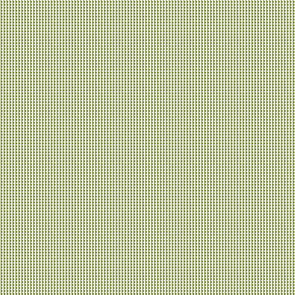

# Traitements d'image (suite)
___
## Consignes de travail

Le module "PIL" sera utilisé pour ce TP. Il sera à importer dans chaque exercice, afin de profiter de ces fonctions dédiées aux manipulations de fichier d'image.

Documentation officielle des fonctions du module importé :
[https://pillow.readthedocs.io/en/stable/reference/Image.html#the-image-class](https://pillow.readthedocs.io/en/stable/reference/Image.html#the-image-class){:target = _blank}

___
##Activités

!!! note "Activité 1 :  Découpage de l'image"

	!!! info "Documentation : fonction `crop()`"

Dans le module `Activité1,py` : à partir de l'image de la pomme (fichier `pomme.jpg`), une nouvelle image `image_quart1` a été créée à partir du premier quart de l'image.

|image\_source|image_quart1|
|:---:|:---:|
|{width = 40%}|{width = 40%}|

Réaliser le découpage des autres morceaux : image_quart2, image_quart3, image_quart4

!!! note "Activité 2 :   Rotation de l'image"

	!!! info "Documentation : fonctions `rotate()` , `paste()`"

1. En utilisant la fonction `rotate()` , modifier les images créées précédemment pour obtenir ce résultat :

|image_quart1|image_quart2|image_quart3|image_quart4|
|:---:|:---:|:---:|:---:|
|||||

2. En utilisant la fonction `paste()`, recoller les morceaux pour former l'image du fichier nommé `pomme_decoupee.jpg`

!!! note "Activité 3 : Redimensionnement"

	!!! info "Documentation : fonction `resize()`"

1. Créer une nouvelle image de la pomme, 4 fois plus petite

2. Créer alors une image, avec 4 exemplaires de celle ci-dessus :

{width=40%}{width=40%}

!!! note "Activité 4 :  Duplication"

En utilisant la séquence précédente, créer une fonction `planche` permettant de faire une planche d'images de la pomme en choisissant le nombre de pommes souhaitées sur un côté :

|||||
|:---:|:---:|:---:|:---:|
|planche(2)|planche(3)|planche(4)|planche(5)|
|||||
|planche(10)|planche(50)|planche(100)|planche(200)|
|||||
