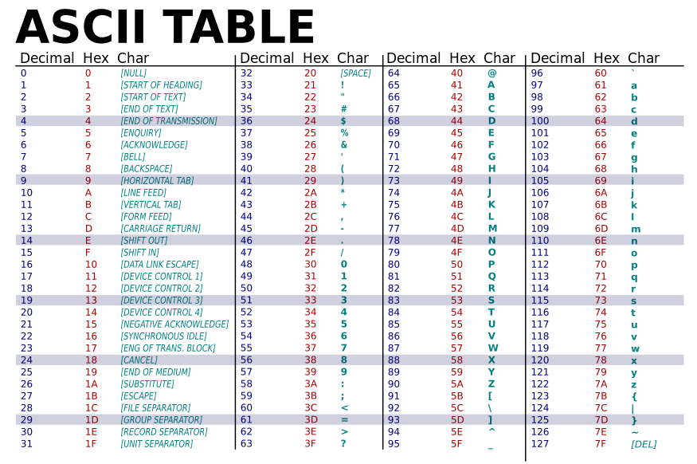
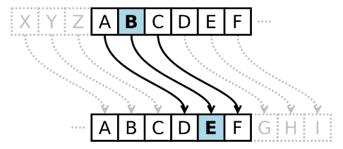
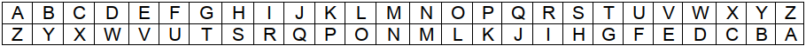
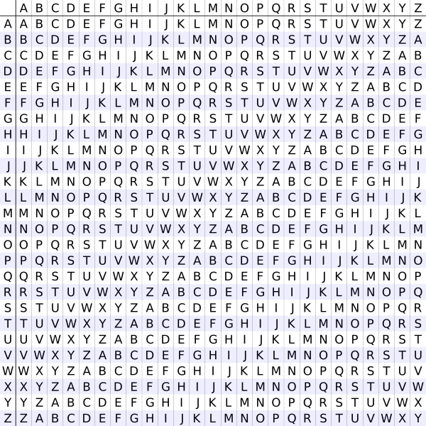
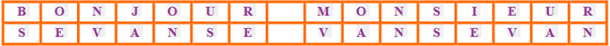
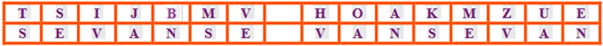
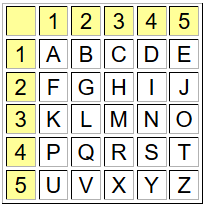
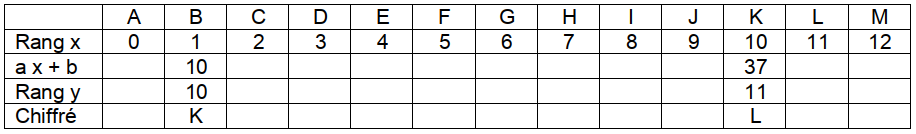
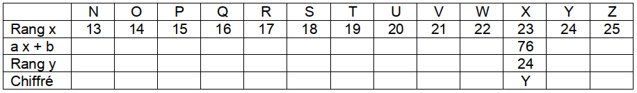
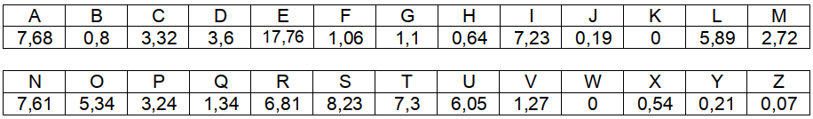

# Cryptographie : quelques méthodes de chiffrements
___
## Introduction

La **cryptographie** est l'une des disciplines de la **cryptologie** : "science du secret".  
Elle s'attache à protéger des messages en utilisant des **secrets ou clés**.  
L'autre discipline est la **cryptanalyse** (elle cherche à trouver les messages).

Le **chiffrement** est la méthode de transformation d'un message clair en un message chiffré (incompréhensible). Cette méthode utilise une **clé de chiffrement**.  
Le **déchiffrement** est la méthode de transformation inverse, avec une **clé de déchiffrement**.

### Cryptographie symétrique (classique)

- Les deux **clés sont identiques**
- La clé est alors secrète

### Cryptographie asymétrique (moderne)
!!! example inline end "Exemples"
    DES, AES, WEP, RSA ...

- Les deux **clés sont différentes**
- La clé de chiffrement est généralement publique
- La clé de déchiffrement est privée


___
## Fonctions utiles à ce TP

`#!python ord(caractere)` : renvoie le nombre entier représentant le code Unicode du caractère
	```python
	ord('A')
	65
	```
	
`#!python chr(valeur)` : renvoie le caractère dont le code Unicode est la valeur donnée.
	```python
	>>> chr(65)
	'A'
	```
Pour ce TP, les caractères utilisés se limiteront à ceux inscrits dans la table ASCII.
??? info "Table ASCII"
    


___
## Le Chiffre de César (ou chiffrement par décalage)

Le chiffrement de César est une méthode de cryptographie des plus anciennes communément admise par l'histoire.  
Il consiste en une substitution mono-alphabétique, où la substitution est définie par un décalage fixe dans l'alphabet. 

César avait l'habitude de prendre 3 : c'était sa **clé de chiffrement**.



Avec cette clé, le mot "**INFORMATIQUE**" est chiffré en "**LQIRUPDWLTXH**"


1. Écrire une fonction `chiffrement_cesar` qui prend en paramètres une chaine de caractères (type `str()`) et une cle (type `int()`).  
La fonction renvoie le chiffrement de cette chaîne par la méthode précédente avec la clé de chiffrement fournie en paramètre.

    !!! example "Exemples"
        ```python
        >>> chiffrement_cesar('INFORMATIQUE',3)
        'LQIRUPDWLTXH'
        >>> chiffrement_cesar('Cesar vs Turing',10)
        'MOCKB FC DEBSXQ'
        ```

    Si votre code le permet, la même fonction peut servir au déchiffrement : 
    
    !!! example "Exemple"
        ```python
        >>> chiffrement_cesar('LQIRUPDWLTXH',-3)
        'INFORMATIQUE'
        ```

2. En utilisant la fonction précédente, décrypter le texte suivant sachant que la clé est 10 :

    **ebqoxd ovswsxob vk mslvo**


3. Quelle clé a été utilisée pour que le texte en clair suivant ?

    "**rendez vous rue de la paix**" donne : "**mziyzu qjpn mpz yz gv kvds**"

    Écrire une fonction `casse_cle_cesar` qui prend en paramètres un `texte_clair` et un `texte_chiffre` (type `str()`).  
    La fonction renvoie la clé de chiffrement qui permet de passer du texte en clair au texte chiffré par la méthode précédente.

    !!! tip "NB : On pourra utiliser la fonction `chiffrement_cesar`."


4. Décrypter le texte suivant en supposant que le mot "**ennemi**" y figure :

    **stywj jssjrn ij ytzotzwx jxy ij wjytzw**


5. Le mot "**AJMQAPA**" a été crypté mais on ignore la clé de chiffrement.  
Trouver la et décrypter ce mot ?


___
## Le chiffre Atbash



Écrire une fonction `chiffrement_atbash` qui prend en paramètre une chaine de caractères (type `str()`) et renvoie son chiffrement par cette méthode décalage.


___
## Le chiffre de Vigenere

En 1586, le diplomate Français Blaise de Vigenère élabore un système de substitution polyalphabétique. Le procédé consiste à remplacer une lettre par une autre qui n’est pas toujours la même.

C’est un système bien plus solide que le code de César (rotation) car elle nécessite une clé de déchiffrement de forme alphabétique et de longueur variable.

En effet, pour pouvoir chiffrer un texte, nous avons besoin d’une clé, dont les caractères sont utilisés pour effectuer la substitution. Évidemment, plus la clé sera longue et variée et mieux le texte sera chiffré.

### Méthode de chiffrement : 

Il est conseillé de disposer de la table de Vigenère :

??? tip "Table de Vigenere"
    
    
- Choisir une clé de (dé)cryptage (exemple : **sevan**)
- Avoir un texte à coder : « **bonjour monsieur** » 
- Faire correspondre la clé avec le texte à coder autant de fois que nécessaire :



- Situer la colonne de la lettre du texte en clair (lettre « **B** »  colonne **B**)
- Situer la ligne de la lettre de la clé (lettre « **S** »  ligne **S**)
- Le croisement de la ligne et la colonne vous donne la lettre codée : « **T** »
- Au final, nous obtenons le texte crypté suivant : « **TSIJBMV HOAKMZUE** » 

### Méthode de déchiffrement :
- Faire correspondre le texte codé avec la clé autant de fois nécessaire pour la clé :  



- Situer la ligne de la lettre de la clé (lettre « **S** »  ligne **S**)
- Sur cette ligne, chercher la colonne de la lettre du texte codé (on cherche « **T** »  colonne **B**). On obtient ainsi la première lettre.
- Le décodage du texte donne : « **Bonjour Monsieur** ».

Pour améliorer le cryptage, on peut choisir plusieurs clés de (dé)cryptage, et les associer les unes après les autres pour le chiffrement.


Écrire une fonction `chiffrement_vigenere` qui prend en paramètres une chaine de caractères (type `str()`) et une cle (type `str()`).
La fonction renvoie le chiffrement de la chaîne par la méthode précédente avec la clé fournie en paramètre.


___
## Le carré de Polybe

C'est un historien Grec nommé **Polybe** qui écrivit le premier procédé de chiffrement par substitution homophonique en l’an -165 av. J.-C. 

Il donna le nom de « carré » à son procédé de cryptage car celui-ci est basé sur un carré de 25 cases (ou plus).

On écrit l'alphabet dans un carré de 25 cases repérées par les chiffres de 1 à 5.  
Le 'W' est supprimé : il est peu utilisé en français, le 'V' le remplecera le cas échéant.

{align=right}
On code chaque lettre par un groupe de deux chiffres : celui de sa ligne et celui de sa colonne.

    A est codé par 11  
    B est codé par 12  
    ....  
    L par 32  
    M par 33  
    ....  

Le chiffrement s'effectuait alors en groupant les nombres par 3.
!!! example "Exemple"
    "**Première NSI**"  est codé par  "**414315  332415  431534  4424**"

1. Écrire une fonction `dechiffrement_polybe` qui prend en paramètre une chaine de caractères (type `str`).  
La fonction renvoie le déchiffrement de la chaîne par la méthode de Polybe.

    !!! example "Exemples"
        ```python
        >>> dechiffrement_polybe('414315  332415  431534  4424')
        'PRE  MIE  REN  SI'
        ```

    !!! tip "NB : L'utilisation d'un dictionnaire peut être envisagé."

2. Décoder le message crypté suivant :

    414335  413544  155134  115145  431513  114343  154115  433315  454511  
    344514  151335  141543  321545  454315  441545  132324  212143  1544 

3. En utilisant un carré plus grand, proposer un moyen de chiffrer toutes les lettres et chiffres.


___
## Le chiffrement affine

Un chiffrement affine consiste à chiffrer chaque lettre de l'alphabet, puis à remplacer le nombre initial $x$ par le nombre y qui est le reste de la division euclidienne de $a x + b$ par $26$.

Les nombres $a$ et $b$ sont des entiers naturels qui forment la clé du cryptage.

!!! example "Exemple avec la clé $(a, b) = (3, 7)$"
    
    

1. Écrire une fonction `chiffrement_affine` qui prend en paramètre une chaine de caractères (type `str`) et un couple de deux nombres (type `tuple`).
La fonction renvoie le chiffrement de la chaîne par cette méthode.

    !!! example "Exemples"
        ```python
        >>> chiffrement_affine('bonjour', (3, 7))
        'KXUIXPG'
        >>> chiffrement_affine('lovelace',(3, 7))
        'OXSTOHNT'
        >>> chiffrement_affine('cesar',(2, 4))
        'IMOEM'
        ```

2. Coder votre prénom avec la clé $(3, 7)$

3. Écrire une fonction `dechiffrement_affine` qui prend en paramètre une chaine de caractères (type `str()`) et un couple de deux nombres (type `tuple()`).  
La fonction renvoie le déchiffrement de la chaîne par cette méthode.

4. Décrypter la phrase **RXF HPJJF** avec la clé $(3, 7)$


___
## Codage et statistiques : la méthode d'Al-kindi 

Les possibilités de codage sont très nombreuses mais le déchiffrement d'un texte chiffré par une méthode de substitution mono-alphabétique n'est pourtant pas impossible, à condition que le texte soit assez long.

Les savants arabes sont les inventeurs de la cryptanalyse (décrypter les messages codés).

Les lettres du texte à coder sont remplacées par d’autres lettres de la façon suivante :

- deux lettres différentes sont codées de façons différentes.
- la même lettre est toujours codée de la même façon. 

Le premier traité exposant une procédure pour décrypter un texte codé de cette a été écrit par **Al Kindi** au neuvième siècle après J.C. Sa théorie repose sur le fait que dans un texte, les lettres ont des fréquences différentes.

Par exemple, en français, la fréquence de la lettre 'E' est, selon le texte, presque toujours supérieure aux fréquences des autres lettres.  
Selon sa théorie, il y a donc de fortes chances pour que, dans un texte codé, la lettre qui apparaît le plus fréquemment représente un 'E'. Les lettres les moins fréquentes représentent probablement un 'W', un 'K' ou un 'X'...

Le tableau ci-dessous exprime, en pourcentage, les fréquences moyennes , des lettres utilisées dans les textes écrits en français :



1. Écrire une fonction `analyse_frequence` qui prend en paramètre un texte (type `str()`) et affiche la fréquence de chaque lettre de l'alphabet dans ce texte.

2. En utilisant la fonction précédente et en faisant correspondre l'analyse produite avec le tableau précédent, décoder le message :

    **BKSMAMZCZMTFY KF OKATOCFZ ZHKY CYZIAMKIYKUKFZ AK UKYYCLK ATOK RTIY CRKP BHCFADM IF XCY OKAMYMB RKHY SC YTSIZMTF BMFCSK OK AKZZK CAZMRMZK  KF FYM**
