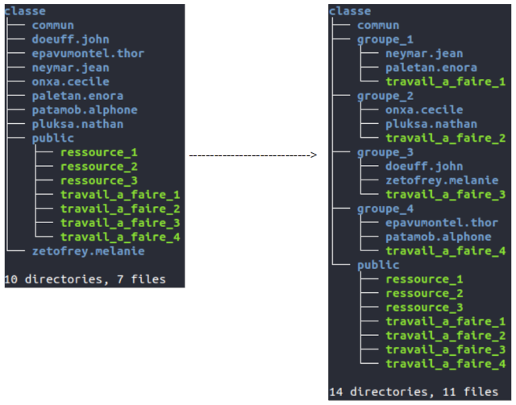

# Commandes shell
___
## Ouvrir un terminal de commande shell

1. Création d'une structure de répertoires de travail :

	a) Copier le fichier `initialisation.sh` dans votre répertoire actuel.  
	b) Exécuter le script de ce fichier en tapant : `./initialisation.sh`  
	c) Quelle commande permet de lister une structure de répertoires ?  
	d) Afficher la structure du répertoire "classe".

2. Avant toute manipulation, faire une copie de ce répertoire dans un répertoire nommé `sauvegarde`

3. En vous plaçant dans le répertoire `classe`, taper la commande
    ```shell
    ls -l
    ```

___
## Droits et permissions

|Colonne|1|2|3|4|5|6|7|
|:-:|:-:|:-:|:-:|:-:|:-:|:-:|:-:|
|Exemple|-rwxr-xr--|2|bob|famille|1450|2012-08-14 12:24|travail.md|

!!! info "Colonne 1 : ce sont les droits et permissions sur le fichier"
    Ils sont écrits sur 10 caractères.
    
    Le 1er caractère donne le type :
     
        “-” pour un fichier normal (exemple travail.md)
        “d” pour un répertoire
        “b” pour un périphérique “bloc”
        “l” pour un lien symbolique

    Les 3 caractères suivant donnent les droits du propiétaire (bob)
    
        “r” (read) droit en lecture sur fichier (lister le contnu pour un répertoire)
        “w” (write) droit en écriture (écriture dans le répertoire)
        “x” (execute) droit d'exécution (exécuter un fichier dans le répertoire)
    
    Les 3 caractères suivant donnent les droits du groupe propiétaire (famille)
    
    Les 3 caractères suivant donnent les droits des autres utilisateurs (tous les autres)  
    (en l'absence de droits, le carctère est remplacé par “-”)

    !!! example "Pour l'exemple: rwxr-xr--"
        `rwx` : le propriétaire peut lire, écrire et éxécuter  
        `r-x` : le groupe du propriétaire peut lire et exécuter  
        `r--` : les autres utilisateurs peuvent lire  

!!! info "Colonne 2 : nombre de liens physiques"
    ??????
!!! info "Colonne 3 : propriétaire du fichier"
    Je s'appelle bob
!!! info "Colonne 4 : groupe du propriétaire"
    Tous les utilisateurs du groupe "famille)"
!!! info "Colonne 5 : taille en octets"
    1 450 o = 1,45 ko
!!! info "Colonne 6 : date et heure de la dernière modification"
    C'était le 14 août 2012 à 12h24
!!! info "Colonne 7 : nom du fichier ou répertoire"
    `travail.md`

1. A l'aide de cette documentation, préciser vos droits sur les répertoires.

2. Quels sont les droits des membres de votre groupe ?

3. A l'aide de commandes du shell, réaliser la transformation de la structure :

    

4. Comparaison des droits pour les répertoires "**public**" et "**commun**"

       a) Qui a les droits d'écriture sur ces répertoires ?  
       b) Expliquer cette différence pour les utilisateurs du groupe.  
       c) Si on souhaite que le propriétaire soit le seul a avoir tous les droits, que devraient être alors les 10 premiers caractères affichés ?

5. Modification des droits pour les fichiers de travail

       a) Lister les droits des fichiers "`travail_a_faire_?`" dans les répertoires "`groupe_?`"  
       b) Les comparer à ceux de la structure de départ.  
       c) En utilisant la commande chmod, modifier les droits sur ces fichiers en donnant le droit d'écriture aux utilisateurs du groupe.  

    !!! tip "Documentation de la commande avec man chmod ou [ici](https://doc.ubuntu-fr.org/permissions#chmod){:target = _blank}"

6. Rédiger une fiche de synthèse de la commande `chmod` : fonction, syntaxe, paramètres, ...

7. Pour aller plus loin :

       a) créer un fichier "structure.sh" dans le répertoire "/Documents"  
       b) y écrire un script shell (suite d'instructions à l'aide de commandes shell) permettant d'effectuer toutes les modifications de strucuture effectuées à la question 7.
        
    !!! tip "aide : commandes `touch` et `nano`"

