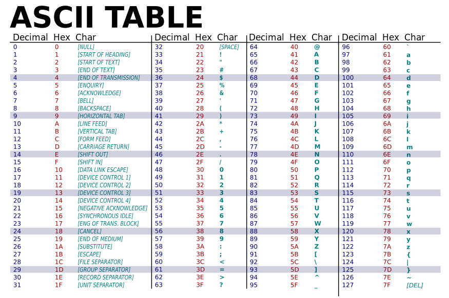
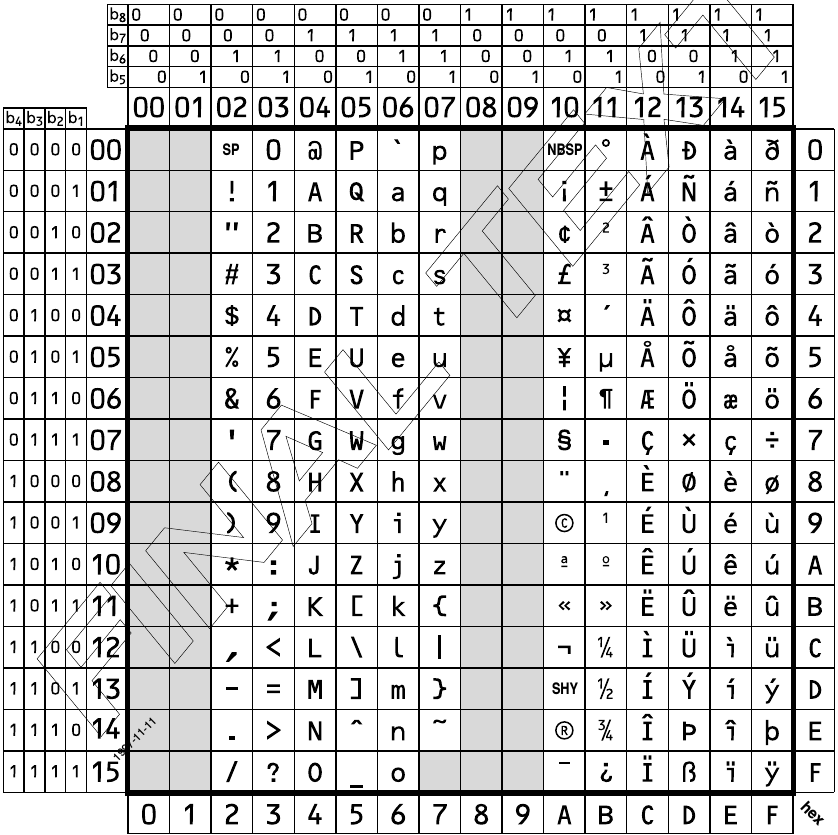

___
## ASCII (American Standard Code for Information Interchange)

Avant 1960 de nombreux systèmes de codage de caractères existaient, ils étaient souvent incompatibles entre eux.

En 1960, l'organisation internationale de normalisation (ISO) décide de mettre un peu d'ordre dans ce bazar en créant la norme **ASCII**.

À chaque caractère est associé un nombre binaire sur 8 bits (1 **octet**).

En fait, seuls 7 bits sont utilisés pour coder un caractère, le 8e bit n'est pas utilisé pour le codage des caractères.

Avec 7 bits il est possible de coder jusqu'à 128 caractères, ce qui est largement suffisant pour un texte écrit en langue anglaise (pas d'accents et autres lettres particulières).

???+ note "Table ASCII"
    

Certains codes ne correspondent pas à des caractères (de $0$ à $(32)_{10}$), mais sont des touches du clavier.

!!! question "Question 1"
    Dans le tableau,  "A" majuscule correspond au code $(65)_{10}$ ou $(41)_{16}$.

    1. Quel est le code binaire associé à la lettre "A" ?
    2. Déterminer également le code binaire du "a" minuscule en ASCII ?
    3. En regardant les autres lettres de l'alphabet, quelle remarque pouvez-vous faire ?

___
## ISO-8859-1

La norme ASCII convient bien à la langue anglaise, mais pose des problèmes dans d'autres langues, par exemple le français : cela ne prévoyait pas d'encoder les lettres accentuées.

C'est pour répondre à ce problème qu'est née la norme ISO-8859-1.

???+ note "Table ISO-8859-1"
    

Cette norme reprend les mêmes principes que l'ASCII, mais les nombres binaires associés à chaque caractère sont codés sur 8 bits, ce qui permet d'encoder jusqu'à 256 caractères.

Elle va être principalement utilisée dans les pays européens puisqu'elle permet d'encoder les caractères utilisés dans les principales langues européennes.

La norme **ISO-8859-1** est aussi appelée "**latin1**" car elle permet d'encoder les caractères de l'alphabet dit "latin".  
Le problème est qu'il existe beaucoup d'autres langues dans le monde qui n'utilisent pas l'alphabet dit "latin", par exemple le chinois ou le japonnais.  
D'autres normes ont donc dû voir le jour, par exemple la norme "GB2312" pour le chinois simplifié ou encore la norme "JIS\_X\_0208" pour le japonais.  

Cette multiplication des normes a très rapidement posé problème.
Imaginons un français qui parle le japonais : 

- Son traitement de texte est configuré pour reconnaître les caractères de l'alphabet "latin" (norme ISO-8859-1).
- Un ami japonais lui envoie un fichier texte écrit en japonais.
- Le français devra modifier la configuration de son traitement afin que ce dernier puisse afficher correctement l'alphabet japonais.
- S'il n'effectue pas ce changement de configuration, il verra s'afficher des caractères ésotériques.

___
## Unicode

Créé en 1991, l'Unicode a pour ambition de rassembler tous les caractères existant afin qu'une personne utilisant Unicode puisse, sans changer la configuration de son traitement de texte, à la fois lire des textes en français ou en japonais.

Unicode est uniquement une table qui regroupe tous les caractères existant au monde, il ne s'occupe pas de la façon dont les caractères sont codés dans la machine.

Unicode accepte plusieurs systèmes de codage :

- **UTF-8** : Le plus utilisé, notamment sur le Web et Unix, son codage à taille variable lui permet d'être en moyenne moins coûteux en occupation mémoire.
- **UTF-16** : bon compris lorsque la place mémoire n'est pas trop restreinte
- **UTF-32** : permet d'avoir un accès direct aux caractères et sans changement de taille (par exemple, les hiéroglyphes égyptiens). Elle utilise le même nombre d'octets par caractère mais en "gaspille" généralement un (toujours nul).

Il y a actuellement environ une centaine de milliers de caractères Unicode (incluant les [caractères des langues vivantes ou mortes](https://unicode.org/cldr/charts/latest/supplemental/languages_and_scripts.html){:target = _blank} et également de [nombreux emojis indispensables](https://unicode.org/emoji/charts-12.0/full-emoji-list.html){:target = _blank})

Pour encoder les caractères Unicode, UTF-8 utilise un nombre variable d'octets : les caractères "classiques" (les plus couramment utilisés) sont codés sur un octet, alors que des caractères "moins classiques" sont codés sur un nombre d'octets plus important (jusqu'à 4 octets).

Les caractères en UTF-8 doivent avoir une forme particulière décrite dans la table ci-dessous :

|Nombre d'octets codant|Format de la représentation binaire|
|:-:|:-:|
|1|0xxxxxxx|
|2|110xxxxx  10xxxxxx|
|3|1110xxxx  10xxxxxx  10xxxxxx|
|4|11110xxx  10xxxxxx  10xxxxxx  10xxxxxx|

{align=right width=20%}

**L'encodage UTF-8 est lui aussi compatible avec l'ASCII.**

En revanche **ISO-8859-1 et UTF-8 sont incompatibles entre eux** pouvant conduire à ce genre de problèmes.

!!! question "Question 2"
    Expliquer le problème apparaissant sur la couverture du livre "Martine".

!!! question "Question 3"
    Quel est le code binaire du "**b**" minuscule Unicode codé avec UTF-8, sachant que celui du "**B**" est $(0100 0010)_2$ ?

!!! question "Question 4"
    Quelle est la taille (en ko) d'un fichier texte contenant 75 000 caractères ?

!!! question "Question 5"
    A l'aide de la table ASCII, répondre aux questions suivantes :

    1. Convertir en binaire la phrase suivante : "**Bonjour, cher ami.**"

    2. Déterminer les mots codés sous cette forme binaire ?

        01101001  01101110  01100110  01101111  00100000  01100110  
        01101111  01110010  00100000  01100101  01110110  01100101  
        01110010  00100000  00100001

