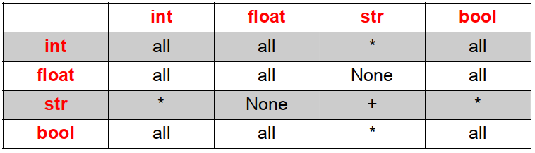

# Notion

Une **variable** permet de stocker une **valeur**.

On peut la comparer à une boîte portant un **nom** (voire plusieurs parfois) et renfermant une valeur.

Il est essentiel d'utiliser des variables : c'est la mémoire de la machine.

- Si on lui demande $2 + 3$, elle répond tout de suite $5$
- Mais si on lui demande de répéter... elle ne sait plus le résultat et encore moins l'opération.

!!! warning "Avoir toujours en tête"
    **La machine fait toujours ce que vous lui demandez.**  
    Il faut utiliser un langage qu'elle comprend (sans faire de faute) et qu'elle soit en capacité de le faire.  
    **Elle ne retient donc que ce que vous lui demandez de retenir.**  
    _La machine a l'intellignence de la personne assise devant elle._

___
# Déclaration

La **déclaration** d’une variable se fait avec l’opérateur d’**affectation  = **

!!! note inline end "chevrons"
    `>>>` sont les 3 chevrons présents dans l'interpréteur Python
    
!!! example "Exemples"
    ```python
    >>> a = 1
    
    >>> b = 2 * a + 10
    ```
    La 1ère **instruction** est **interprétée** :
    !!! note inline end "langage haut niveau"
        1 instruction en Python  
        4 pour d'autres langages...

    - la **variable** « $a$ » est créée  
        - nom  
        - place en mémoire
    - Python lui affecte le nombre 1 comme **valeur**
    - la variable possède alors un **type** : le même que sa valeur **1**

    La 2ème instruction est interprétée comme `#!python >>> b = 12` car :
 
    - Python **interprète** d'abord l'**expression** `#!python 2 * a + 10` :

        - il reconnaît un calcul : opérateurs, nombres et une variable qu’il connaît de la première instruction
        - il effectue donc le calcul en prenant la valeur de la variable
        - le résultat 12 est alors **affecté** à la variable b
    
    !!! warning
        Si la variable $a$ change de valeur plus tard, la variable $b$ ne change pas de valeur.

Python permet certaines déclarations, assez pratiques.

!!! note "Ecritures particulières"
    === "affectations multiples"
        ```python
        >>> a = 10
        >>> b = 21      peut s'écrire      >>> a, b, c = 10, 21, 48
        >>> c = 48

        >>> a = 10
        >>> b = 10      peut s'écrire      >>> a = b = 10
        ```

    === "cas particulier à Python"
        ```python
        >>> a = 10
        >>> b = 21
        >>> a, b = b, a
        ```
        Les 2 variables ont échangé leurs valeurs.
        $a$ possède la valeur $21$ et $b$ possède la valeur $10$.

___
# Nommage

Un nom de variable doit **respecter ces règles** du langage :

- C’est une séquence de lettres (a → z , A → Z) et de chiffres (0 → 9), qui doit toujours commencer par une lettre ou le caractère souligné _ (++8++)
- Seules les lettres ordinaires sont autorisées : accents, cédilles, espaces, caractères spéciaux ($, #, @, etc...) sont interdits à l’exception du caractère souligné _ ("underscore")
- La casse est importante (les caractères majuscules et minuscules sont distingués)
- Le nom ne doit pas correspondre à un **mot réservé** au langage Python :

!!! note inline end
    Inutile de tous les retenir. Thonny vous aidera à les repérer grâce à sa coloration syntaxique.

||||||||
|:-|:-|:-|:-|:-|:-|:-|
|and|as|assert|break|class|continue|def|
|del|elif|else|except|False|finally|for|
|from|global|if|import|in|is|lambda|
|True|try|while|with|yield|||

Il est aussi **fortement conseillé** qu'un nom de variable suive aussi ces conventions d'écriture, définie par la **[PEP 8](https://www.python.org/dev/peps/pep-0008/){target=_blank}** :

- Choisir un nom **explicite** (qui veut dire quelque chose), en rapport avec son utilisation dans le programme

    !!! example "Exemples"
        ```python
        age  
    	date_de_naissance  
    	nom_joueur1  
    	quantite_lettre  
    	taille_lettre
    	```
    	
- Si on affecte à une variable une valeur **constante** définie pour tout le programme, elle est écrite en **majuscules**.  
    Sinon, elle est écrite en minuscules

- Mettre un "**espace**"  
    avant et après l'opérateur d'affectation  
    après une virgule  
    pour séparer les opérateurs dans un calcul

_En suivant ces conventions, la lecture et compréhension du code en sont facilitées pour ceux qui le regardent mais surtout pour son auteur._

___
# Types de bases (ou simples)
Python en possède quatre :
!!! note inline end
    Pour connaître le type d'une variable, on peut utiliser la fonction `type()`  
    `#!python type(nom_de_la_variable)`
- 2 types numériques : 
  
    - **int** (abréviation de integer) : **nombre entier relatif**  
    - **float** (flottant en français) : **nombre réel**

- 1 type alphanumérique :
    **str** (abréviation de string, chaîne) : **caractère ou chaîne de caractères**  
(la valeur est alors écrite entre simples, doubles ou triples quotes : '....' ou "...." ou '''....''')
- 1 type logique :
    **bool** (abréviation de booléen) : **True** ou **False**  (2 valeurs posibles)


___
# Modification
Une variable peut être modifiée au cours d’un programme :

- avec une **nouvelle affectation**

    !!! example "Exemples"
        === "nouvelle valeur"
            ```python
            >>> a = 1
            ...
            ...
            >>> a = 20
            ```
        === "incrémentation (ajout à la valeur précédente)"
            ```python
            >>> a = 45
            ...
            ...
            >>> a = a + 10
            ```

- avec un **changement de type**, avec les fonctions `#!python int(), float(), str() et bool()`

    !!! example "Exemples"
        === "float --> str"
            ```python
            >>> a = 2.24
            >>> type(a)
            <class 'float'>
            >>> a = str(a)
            >>> a
            '2.24'
            >>> type(a)
            <class 'str'>
            ```
        === "float --> int"
            ```python
            >>> a = 12.94
            >>> a = int(a)
            >>> a
            12
            >>> type(a)
            <class 'int'>
            ```

___
# Opérations
Les opérateurs arithmétiques utilisés sont

- `+ -` pour l'addition et la soustraction  
- `*` pour la multiplication
- `**` pour l'élévation à la puissance
- `/` pour la division "simple"
- `//` pour la divsion euclidienne ("entière")
- `%` pour le reste de la division euclidienne

Leurs actions sur les variables peuvent se résumer ainsi :  
!!! note inline end
    **all** : toutes opérations  
    **None** : aucune fonctionne
{width=500}

Résutats particuliers obtenus (quand l'action est possible) :

- l'utilisation d'un **float** donne un **float** et le **résultat n'est pas toujours exact**
- l'utilisation d'un str donne toujours un **str**
- la division / donne toujours un **float**
- la division entière **//** et le modulo **%** donne un **int** (si un **float** n'est pas utilisé)
- **True** est remplacé par **1** et **False** par **0**

