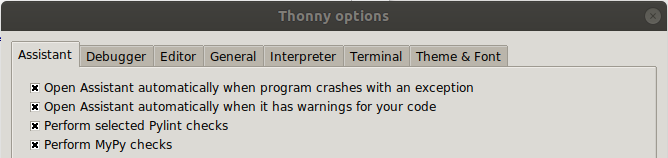
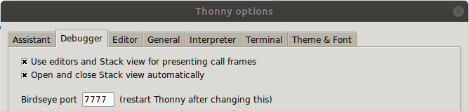
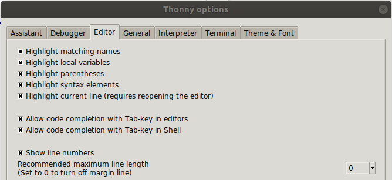
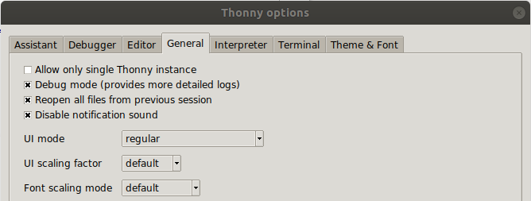
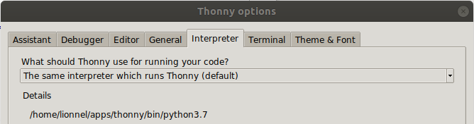
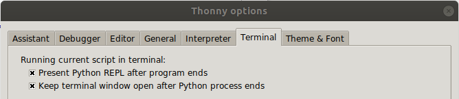
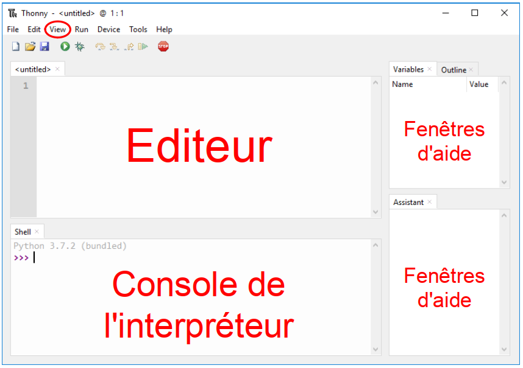

___
## Pourquoi ?
Pour aider à l'écriture du langage, et donc à la programmation, on utilise un **I.D.E.** : **E**nvironnement de **D**éveloppement **I**ntégré en français.

Thonny, mis au point par l'Université de Tartu en Estonie, intègre :

- un interpréteur Python
- un débugger pas à pas (détecteur de syntaxe, décomposition des instructions...)
- une interface d'installation de paquets Python
- un éditeur avancé (coloration syntaxique, auto-complétion et auto-indetation du code, mise en commentaire, surbrillance des erreurs...)
- des fenêtres d'aide (assistant, variables, fonctions...)

Il est simple, multiplateforme, libre et gratuit.

___
## Installation

1. Téléchargement sur le site officiel : [https://thonny.org/](https://thonny.org/){target=_blank}

2. Configuration des options : ‘**Tools**’ → ‘**Options**’

    !!! summary "Onglets"
        !!! warning inline end
            L'ordre et le nom des onglets diffèrent suivant les versions et S.E.
        === "Assistant"
            
    
        === "Debugger"
            

        === "Editor"
            
    
        === "General"
            
    
        === "Interpreter"
            
    
        === "Terminal"
            

    !!! note inline end
        nom du paquet  
        → ‘**Find package from PyPI**’  
        → ‘**Install**’

3. Installation de paquets suplémentaires : ‘**Tools**’ --→ ‘**Manage packages**...’

    Bibliothèques Modules nécessaires (dans un premier temps) :

    - **pillow** : gestion des images numériques
    - **matplotlib** : graphiques
    - **folium** : cartographie

___
## Utilisation

