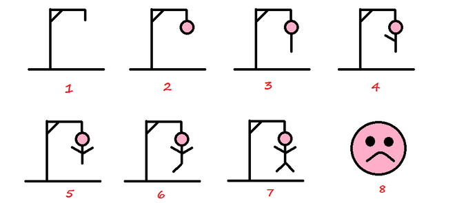

___
## Cahier des charges

### Commande :

Établir un programme permettant de jouer au jeu du pendu.

### Règle du jeu :

Le Pendu est un jeu consistant à trouver un mot en devinant les lettres qui le composent.  
Le jeu se joue traditionnellement à deux, selon un déroulement bien particulier. 

### Déroulement du jeu ([selon wikipédia](https://fr.wikipedia.org/wiki/Le_Pendu_(jeu)){:target = _blank})

Les deux joueurs dans cet exemple s'appellent Stéphane et Julien :
 
- Julien pense à un mot et dessine une rangée de tirets, chacun correspondant à une lettre de ce mot.
- Stéphane annonce une lettre. 
- La lettre fait-elle partie du mot ?
    - Oui : Julien l'inscrit à sa place autant de fois qu'elle se trouve dans le mot. 
    - Non : Julien dessine le premier trait du pendu.
- Le jeu se poursuit jusqu'à ce que : 
    - Stéphane gagne la partie en trouvant toutes les lettres du mot. 
    - Julien gagne la partie en complétant le dessin du pendu.
    

### Aménagement : 

- le nombre d'erreurs est libre : le dessin ci-dessus n'est qu'un exemple
- l’aspect graphique du jeu n’est pas une priorité : on peut établir un décompte du nombre d'erreurs

### Contraintes : 

- le mot est un nom commun de la langue française, écrit en majuscule sans accent
- une proposition de mot n’est pas prévue

### Prolongement (facultatif) : 

- l’aspect graphique peut être envisagé
- variante 1 : Julien est l’ordinateur, Stéphane est l’utilisateur
- variante 2 : Julien est l’utilisateur, Stéphane est l’ordinateur

___
??? info "Fiches de projets en version pdf"
    [Cahier des charges](Cahier%20des%20charges.pdf){:target = _blank}  
    [Fiche 1](Fiche%20de%20suivi%20projet%20_%201.pdf){:target = _blank}  
    [Fiche 2](Fiche%20de%20suivi%20projet%20_%202.pdf){:target = _blank}

??? info "Aide aux prolongements"
    [Fichiers de plus de 20 000 mots](Prolongement%20dictionnaire/mots_francais_sans_accents.txt){:target = _blank}  
    [Module pour utiliser le fichier de mots](Prolongement%20dictionnaire/module_dico.py){:target = _blank}