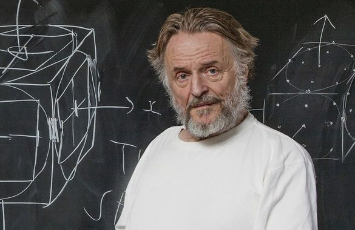
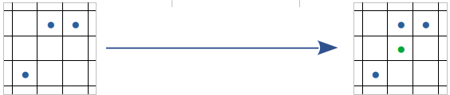
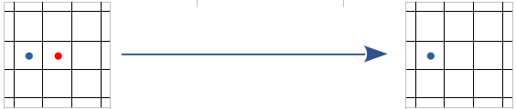
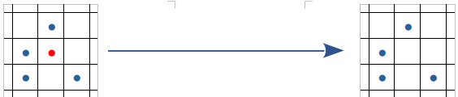
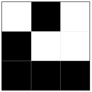
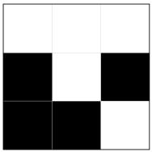
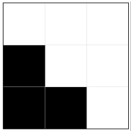
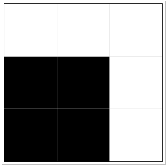

___
Le "jeu de la vie" est un **automate cellulaire** : ensemble de cellules représenté par une grille qui peut évoluer au cours du temps.

{align=right width=300}

En réponse à un problème de John von Neumann qui recherchait une machine capable d'auto-réplication, [John Horton Conway](https://fr.wikipedia.org/wiki/John_Horton_Conway){target=_blank}, en 1970, a construit ce modèle mathématique basé sur un algorithme avec des règles basiques.

Aujourd'hui, les automates cellulaires, comme le "jeu de la vie", sont utilisés dans des simulations informatiques : évolution des cellules vivantes dans un organisme, évolution de certaines populations...

Dans le cadre du projet, on utilisera les règles fixées à l'origine par J.H. Conway :

- l'espace de simulation sera une grille suffisamment grande (16 x 16  minimum)
- chaque case peut contenir au plus une cellule : 0 ou 1 cellule
- l'automate cellulaire évolue dans le temps par succession de générations.

Les cellules naissent, survivent ou meurent en fonction de leur voisinage, à chaque génération :

**Une cellule naît dans une case qui possède exactement 3 cellules voisines.**



**Une cellule meurt si elle est isolée (sous-population) :  < 2 cellules voisines.**



**Une cellule meurt si elle est entourée de plus de trois cellules (sur-population).**



**Une cellule survie donc que lorsqu'elle a 2 ou 3 cellules voisines (stabilité).**

___
## Évolution d'un "jeu de la vie"

Votre projet sera à rendre dans un seul fichier : `jeu_de_la_vie.py`

Il s'appuie sur le [travail préparatoire](preparation.md) : le module `grille.py`

Ce module renferme un certain nombre de fonctions que l'on pourra appeler en les important, tout comme une librairie, avec l'instruction :
```python from grille import *```	Les deux fichiers devront être situés dans le même répertoire !

Rappel des fonctions :

    creer_grille  
	hauteur_grille  
	largeur_grille  
	creer_grille_aleatoire  
	afficher_grille  
	voisins_case  
	nb_cases_voisins_occup  

Un autre module est aussi mis à votre disposition : `affichage_grille.py`  
Il permet l'affichage de la grille du jeu de la vie dans une fenêtre graphique (Voir la fonction `exemple()` dans ce module, pour connaître son utilisation).


## Génération suivante
**Réaliser** la fonction `generation_suivante` qui, à partir d'une grille passée en paramètre, calcule la grille de la génération suivante et la renvoie.

La nouvelle génération est calculée à partir des critères de naissance ou de mort des cellules indiqués sur la page précédente.

Dans le jeu de la vie, on considère que la nouvelle génération apparaît spontanément dans toutes les cases au même moment.

```python
:examples:
>>> grille = [[0, 1, 0], [1, 0, 0], [1, 1, 1]]
>>> generation_suivante(grille)
[[0, 0, 0], [1, 0, 1], [1, 1, 0]]
>>> generation_suivante([[0, 0, 0], [1, 0, 1], [1, 1, 0]])
[[0, 0, 0], [1, 0, 0], [1, 1, 0]]
>>> generation_suivante([[0, 0, 0], [1, 0, 0], [1, 1, 0]])
[[0, 0, 0], [1, 1, 0], [1, 1, 0]]
```

|grille|1ère génération|2ème génération|3ème génération|
|:-:|:-:|:-:|:-:|
|||||


## Évolution au fil de n générations
**Réaliser** une procédure `evolution_n_generations` qui prend en paramètre une grille et un entier naturel n et qui va afficher l'évolution de la grille au fil de n générations.

!!! tip "Temps de pause"
	Afin de mieux visualiser l'évolution nous ferons une pause d'une seconde entre chaque génération.  
	La fonction `sleep()` du module time vous permettra de faire une telle pause (voir la documentation de cette fonction pour savoir comment l'utiliser).


## Simulation de l'évolution d'une population de cellules
En utilisant la fonction précédente, **simuler** l'évolution d'une grande population de cellules :

- grille : 100 x 100 minimum
- peuplement aléatoire de la grille initiale
- nombre de générations : env. 1 000   (réduire le temps de pause)

**Etudier** la survie de la population de cellules en fonction de la probabilité de peuplement de départ.


## Pour aller plus loin : Motifs récurrents
Quelques motifs récurrents peuvent être obtenus à partir de grilles particulières.

!!! example "Motifs"
    === "Oscillateur"
        Un oscillateur à deux états peut être obtenu avec cette grille :

        ```python
        oscillateur = [[0, 0, 1, 0], [1, 0, 0, 1], [1, 0, 0, 1], [0, 1, 0, 0]]
        ```

    === "Galaxie"
        Encore un oscillateur avec des formes de ...
        ```python
        galaxie = [[0] * 15, [0] * 15, [0] * 15, [0, 0, 0, 1, 1, 1, 1, 1, 1, 0, 1, 1, 0, 0, 0], [0, 0, 0, 1, 1, 1, 1, 1, 1, 0, 1, 1, 0, 0, 0], [0, 0, 0, 0, 0, 0, 0, 0, 0, 0, 1, 1, 0, 0, 0], [0, 0, 0, 1, 1, 0, 0, 0, 0, 0, 1, 1, 0, 0, 0], [0, 0, 0, 1, 1, 0, 0, 0, 0, 0, 1, 1, 0, 0, 0], [0, 0, 0, 1, 1, 0, 0, 0, 0, 0, 1, 1, 0, 0, 0], [0, 0, 0, 1, 1, 0, 0, 0, 0, 0, 0, 0, 0, 0, 0], [0, 0, 0, 1, 1, 0, 1, 1, 1, 1, 1, 1, 0, 0, 0], [0, 0, 0, 1, 1, 0, 1, 1, 1, 1, 1, 1, 0, 0, 0], [0] * 15, [0] * 15, [0] * 15]
        ```
    === "Planeur"
        Un "planeur" est un motif qui se déplace jusqu'à disparaître de la grille.  
        Voici une grille permettant d'obtenir un planeur qui se répète toutes les quatre générations en s'étant déplacé d'une case vers le bas et d'une case vers la droite à chaque génération :

        ```python
        planeur = [[0, 1, 0, 0, 0, 0, 0, 0, 0, 0, 0], [0, 0, 1, 0, 0, 0, 0, 0, 0, 0, 0], [1, 1, 1, 0, 0, 0, 0, 0, 0, 0, 0], [0] * 11, [0] * 11, [0] * 11, [0] * 11, [0] * 11, [0] * 11, [0] * 11, [0] * 11]
        ```

    === "Canons"
        Des "canons à planeurs" sont des oscillateurs projetant des planeurs.  
        Une grille plus grande est nécessaire pour visualiser le phénomène :

        ```python
        canons = [[0] * 44, [0, 0, 0, 0, 0, 0, 0, 0, 0, 0, 0, 0, 0, 0, 0, 0, 0, 0, 0, 0, 0, 0, 0, 0, 0, 0, 0, 1, 0, 0, 0, 0, 0, 0, 0, 0, 0, 0, 0, 0, 0, 0, 0, 0], [0, 0, 0, 0, 0, 0, 0, 0, 0, 0, 0, 0, 0, 0, 0, 0, 0, 0, 0, 0, 0, 0, 0, 0, 0, 1, 0, 1, 0, 0, 0, 0, 0, 0, 0, 0, 0, 0, 0, 0, 0, 0, 0, 0], [0, 0, 0, 0, 0, 0, 0, 0, 0, 0, 0, 0, 0, 0, 0, 1, 1, 0, 0, 0, 0, 0, 0, 1, 1, 0, 0, 0, 0, 0, 0, 0, 0, 0, 0, 0, 0, 1, 1, 0, 0, 0, 0, 0], [0, 0, 0, 0, 0, 0, 0, 0, 0, 0, 0, 0, 0, 0, 1, 0, 0, 0, 1, 0, 0, 0, 0, 1, 1, 0, 0, 0, 0, 0, 0, 0, 0, 0, 0, 0, 0, 1, 1, 0, 0, 0, 0, 0], [0, 0, 0, 1, 1, 0, 0, 0, 0, 0, 0, 0, 0, 1, 0, 0, 0, 0, 0, 1, 0, 0, 0, 1, 1, 0, 0, 0, 0, 0, 0, 0, 0, 0, 0, 0, 0, 0, 0, 0, 0, 0, 0, 0], [0, 0, 0, 1, 1, 0, 0, 0, 0, 0, 0, 0, 0, 1, 0, 0, 0, 1, 0, 1, 1, 0, 0, 0, 0, 1, 0, 1, 0, 0, 0, 0, 0, 0, 0, 0, 0, 0, 0, 0, 0, 0, 0, 0], [0, 0, 0, 0, 0, 0, 0, 0, 0, 0, 0, 0, 0, 1, 0, 0, 0, 0, 0, 1, 0, 0, 0, 0, 0, 0, 0, 1, 0, 0, 0, 0, 0, 0, 0, 0, 0, 0, 0, 0, 0, 0, 0, 0], [0, 0, 0, 0, 0, 0, 0, 0, 0, 0, 0, 0, 0, 0, 1, 0, 0, 0, 1, 0, 0, 0, 0, 0, 0, 0, 0, 0, 0, 0, 0, 0, 0, 0, 0, 0, 0, 0, 0, 0, 0, 0, 0, 0], [0, 0, 0, 0, 0, 0, 0, 0, 0, 0, 0, 0, 0, 0, 0, 1, 1, 0, 0, 0, 0, 0, 0, 0, 0, 0, 0, 0, 0, 0, 0, 0, 0, 0, 0, 0, 0, 0, 0, 0, 0, 0, 0, 0], [0, 0, 0, 0, 0, 0, 0, 0, 0, 0, 0, 0, 0, 0, 0, 0, 0, 0, 0, 0, 0, 0, 0, 0, 0, 0, 0, 0, 0, 0, 0, 0, 0, 0, 0, 0, 0, 0, 0, 0, 0, 0, 0, 0], [0] * 44, [0] * 44, [0] * 44, [0] * 44, [0] * 44, [0] * 44, [0] * 44, [0] * 44, [0] * 44, [0] * 44, [0] * 44, [0] * 44, [0] * 44, [0] * 44, [0] * 44, [0] * 44, [0] * 44, [0] * 44, [0] * 44, [0] * 44, [0] * 44, [0] * 44]
        ```

**Tester** chacune de ces configurations.  
**Réaliser** la collision d'un planeur sur une galaxie.

??? tip "Aide à la conception"
    [Module Python pour créer graphiquement une map de cellules.](creation_map.py){:target = _blank}

## Approfondissements :

Simulation vie cellulaire, avec un lissage des pixels :  
	[https://www.youtube.com/watch?v=eaIgKXwzTQQ](https://www.youtube.com/watch?v=eaIgKXwzTQQ){:target = _blank}  
	[https://www.youtube.com/watch?v=2U1mMEJ6tX8](https://www.youtube.com/watch?v=2U1mMEJ6tX8){:target = _blank}

Motifs récurrents à grande échelle :  
	[https://www.youtube.com/watch?v=so7XunsVDOo](https://www.youtube.com/watch?v=so7XunsVDOo){:target = _blank}  
	[https://www.youtube.com/watch?v=-FaqC4h5Ftg](https://www.youtube.com/watch?v=-FaqC4h5Ftg){:target = _blank}  
	[https://www.youtube.com/watch?v=Su1Uu4_wIak](https://www.youtube.com/watch?v=Su1Uu4_wIak){:target = _blank}

D'autres automates cellulaires, en 3 D :  
	[https://www.youtube.com/watch?v=_W-n510Pca0](https://www.youtube.com/watch?v=_W-n510Pca0){:target = _blank}
