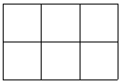
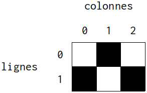
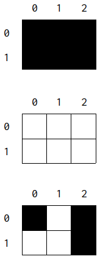
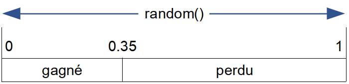
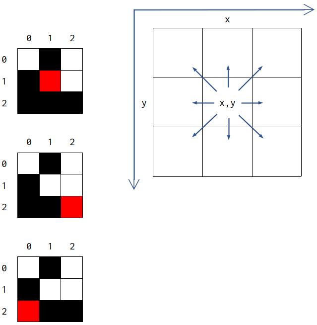

___
Cette série d'activités est à réaliser sous la forme d'un unique module `grille.py`

L'idée est de manipuler des données de types construits afin de construire une grille.  
Beaucoup de situations sont représentées sous cette forme : tableau de données, plateau ou grille de jeux (morpion, puissance 4, échecs, dames, ...), grille de simulation ...

Ce travail de préparation servira de base au [projet du "jeu de la vie"](index.md).

## Introduction
Dans le langage Python, une grille peut être représenté par une **list de list**.  
Un nombre entier peut représenter l'occupation d'une case :

- 0 si elle est vide
- 1 si elle est occupée

!!! example "Exemple de grille"
    ```python
    grille = [[0, 0, 0], [0, 0, 0]]
    ```
    {align=right}
    La grille ci-dessus est composé de 6 cases, 3 cases en largeur et 2 cases en  hauteur.  
    Pour une meilleure représentation, on peut d'ailleurs l'écrire de cette manière :  
    ```python
     grille = [[0, 0, 0],      	2 lignes et
               [0, 0, 0]]     	3 colonnes
    ```

!!! done "Construction d'une grille (2 possibilités)"
    Voir fichier fourni `construction_grille.py`)

    === "2 boucles `for`"
        ```python
        grille = []
        for nb_lig in range(2) :
        
            ligne = []
        
            for nb_col in range(3) :
                ligne.append(0)
        
            grille.append(ligne) 
        ```
        
    === "par compréhension"
        ```python
        grille = [[0 for nb_col in range(3)] for nb_lig in range(2)]
        ```

Le contenu d'une case est ```grille[numero_de_ligne][numero_de_colonne]```

!!! example "Remplissage de grille"
    ```python
    >>> grille = [[0, 0, 0],
                  [0, 0, 0]]
    ```
    Sur la 1ère ligne (indice 0), dans la 2è colonne (indice 1) :
    ```python
    >>> grille[0][1] = 1
    ```
    Sur la 2è ligne (indice 1), dans la 1ère colonne (indice 0) :
    ```python
    >>> grille[1][0] = 1
    ```
    Sur la 2è ligne (indice 1), dans la 1ère colonne (indice 2) :
    ```python
    >>> grille[1][2] = 1
    ```
    {align=right width=25%}
    On obtient alors :  
    ```python
    >>> grille                  autrement écrit : [[0, 1, 0],
    [[0, 1, 0], [1, 0, 1]]                          [1, 0, 1]]
    ```

Remarque : la représentation mise en place est suffisante pour une situation simple où seule l'occupation de la case est utile.  
Si on veut représenter un jeu de dame, il faudrait mettre en place un autre codage, par exemple :

- 0 : case vide
- 1 : pion noir
- 2 : pion blanc

_Et il faudrait en plus réfléchir au codage des dames blanches et noires..._


___
## Activité 1 : Construction d'une grille vide
Établir une fonction `creer_grille` qui prend en paramètre le nombre de cases horizontalement, puis verticalement et qui renvoie une liste de listes correspondant à une grille aux dimensions souhaitées, ne contenant rien (ce qui correspondra à des cases remplies avec un _zéro_).

!!! done "Attendu"
    ```python
    examples:
    >>> creer_grille(3, 4)
    [[0, 0, 0], [0, 0, 0], [0, 0, 0], [0, 0, 0]]
    >>> creer_grille(5, 4)
    [[0, 0, 0, 0, 0], [0, 0, 0, 0, 0], [0, 0, 0, 0, 0], [0, 0, 0, 0, 0]]
    ```


___
## Activité 2 : Dimensions d'une grille
Ecrire une fonction `hauteur_grille` qui prend en paramètre une grille et qui renvoie le nombre de cases verticales.

!!! done "Attendu"
    ```python
    :examples:
    >>> hauteur_grille([[0, 1, 0], [1, 0, 1]])
    2
    >>> hauteur_grille(creer_grille(4, 5))
    5
    ```

Ecrire une fonction `largeur_grille` qui prend en paramètre une grille et qui renvoie le nombre de cases horizontales.

!!! done "Attendu"
    ```python
    :examples:
    >>> largeur_grille([[0, 1, 0], [1, 0, 1]])
    3
    >>> largeur_grille(creer_grille(4, 5))
    4
    ```

___
## Activité 3 : Initialisation d'une grille
La grille créée par la fonction `creer_grille` ne contient rien (il n'y a que des zéros). 

Réalisez une fonction `creer_grille_aleatoire` qui prend en paramètre les dimensions horizontales et verticales d'une grille et une probabilité $p$ (qui correspond à la probabilité pour une case de la grille d'être occupée).

La probabilité est un nombre compris entre $0$ et $1$, si $p = 0,35$ cela veut dire qu'il y a $35 %$ de chances que la case soit occupée.

!!! done "Attendu"
    {align=right width=15%}
    ```python
    :examples:

    >>> creer_grille_aleatoire(3, 2, 1)    # Probabilité = 1
    [[1, 1, 1], [1, 1, 1]]                  # 100 % de chances que chaque case soit occupée
    
    
    
    
    >>> creer_grille_aleatoire(3, 2, 0)    # Probabilité = 0
    [[0, 0, 0], [0, 0, 0]]                  # 0 % de chances que chaque case soit occupée
    
    
    
    
    >>> creer_grille_aleatoire(3, 2, 0.5)  # Probabilité = 0,5
    [[1, 0, 1], [0, 0, 1]]                  # 50 % de chances que chaque case soit occupée
    ```

Remarque :  La fonction `random()` de la bibliothèque `random` génère un nombre pseudo-aléatoire compris entre $0$ et $1$.  
Si on veut faire un tirage au sort avec une probabilité $p$, on pourra s'inspirer de cet exemple :

!!! example "Tirage au sort avec une probabilité $p = 35 \%$"
    !!! warning inline end
        Il faudra importer la fonction `random` :  
        ```python
        from random import random
        ```
    {width=50%}

    ```python
    if random() <= 0.35:
        print("gagné")

    else:
        print("perdu")
    ```


___
## Activité  4 : Afficher une grille
Visualiser une grille sous forme de listes de listes n'est pas aisé.  
!!! note inline end "procédure ?"
    Une procédure est une fonction qui ne renvoie rien (pas de `return`).

Nous allons donc réaliser une procédure `afficher_grille` dont le rôle sera d'afficher de manière plus claire une grille qui lui est passé en paramètre.

Les cases vides seront affichées avec un tiret bas (`_`) et les cases contenant quelque chose seront affichées avec un O majuscule (`O`). 

Le contenu des cases sera séparé par un espace.  
Chaque ligne de la grille sera affichée sur une ligne distincte.

Pour les exemples qui suivent (jusqu'à la fin de l'énoncé), nous considérons définie une variable grille qui permettra de faire vos essais :

!!! done "Attendu"
    ```python
    :examples:
    >>> grille = [[0, 1, 0], [1, 0, 0], [1, 1, 1]]
    >>> afficher_grille(grille)
    _ O _
    O _ _
    O O O
    >>> afficher_grille(creer_grille(3, 2))
    _ _ _
    _ _ _
    >>> afficher_grille(creer_grille_aleatoire(3, 2, 1))
    O O O
    O O O
    ```
    

___
## Activité 5 : Voisins d'une case
Réalisez une fonction `voisins_case` qui prend en paramètre une grille ainsi que les coordonnées en abscisse et en ordonnée d'une case (la coordonnée 0,0 étant la case en haut à gauche).  
La fonction renvoie une liste contenant la valeur des cases voisines de la case donnée en paramètre.  
L'ordre dans lequel les valeurs sont renvoyées n'est pas spécifié.  
Dans l'exemple ci-dessous, les valeurs des cases voisines sont renvoyées ligne par ligne, de gauche à droite.

!!! done "Attendu"
    {align=right width=35%}
    ```python
    :examples:
    >>> grille = [[0, 1, 0],
                   [1, 0, 0],
                   [1, 1, 1]]
    >>> voisins_case(grille, 1, 1)
    [0, 1, 0, 1, 0, 1, 1, 1]


    
    >>> voisins_case(grille, 2, 2)
    [0, 0, 1]


    >>> voisins_case(grille, 0, 2)
    [1, 0, 1]
    ```

___
## Activité 6 : nombre de cases occupées dans le voisinage
Ecrire une fonction `nb_cases_voisins_occup` qui prend en paramètre une grille ainsi que les coordonnées d'une case et qui renvoie le nombre de cases occupées dans les cases voisines de la case passée en paramètre.

!!! done "Attendu"
    ```python
    :examples:
    >>> grille = [[0, 1, 0], [1, 0, 0], [1, 1, 1]]
    >>> nb_cases_voisins_occup(grille, 1, 1)
    5
    >>> nb_cases_voisins_occup(grille, 2, 2)
    1
    ```
